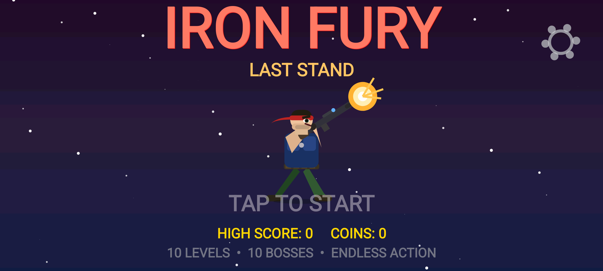
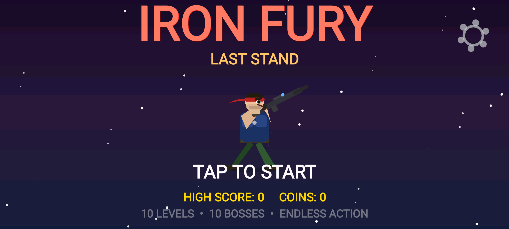
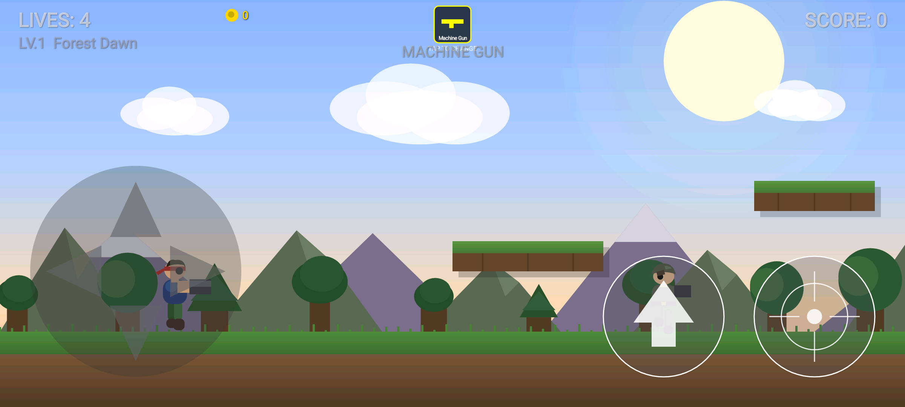

# Iron Fury: Last Stand

[](https://github.com/llassan/iron_fury)

A retro run-and-gun side-scrolling shooter for Android, built in **pure Kotlin + Canvas**
(no game engine). Landscape, logical 800×450 canvas scaled to the device. Shipped on the
Play Store as `com.ironfury.laststand`.


## Play

```bash
./gradlew assembleDebug          # build the debug APK
./gradlew installDebug           # install on a connected device / emulator
```

- **D-pad** to move and aim, **jump** to leap gaps/enemies, **fire** to shoot.
- Drop **prone** to take cover and lay down fire; enemy bullets glow red so incoming fire
  reads at a glance.
- Tap the weapon selector to switch between unlocked weapons; power-up drops give an
  instant mid-battle swap.
- Controls (D-pad/button size, position) are adjustable in Settings and saved automatically.

## Features

- **20 hand-themed levels** — forests, deserts, frozen peaks, volcanic depths, neon cities,
  sunken ruins, sky fortresses, haunted swamps, crystal caverns, and beyond — each with its
  own platform layout and escalating difficulty (`level/Level.kt`, `level/LevelThemes.kt`).
- **10 boss archetypes**, each its own class under `entities/bosses/` (War Machine, Sand
  Scorpion, Ice Titan, Magma Lord, Cyber Overlord, Kraken, Storm Emperor, Swamp Horror,
  Crystal Guardian, Supreme Commander) with attack patterns that escalate as they take damage.
- **5 weapons** (Machine Gun, Spread Gun, Laser, Rocket Launcher, Flamethrower) — buy
  permanently with coins or grab a power-up drop for an instant switch (`weapons/`).
- **Unlockable characters** with distinct looks, bought with in-battle coins
  (`cosmetics/CharacterSkin.kt`).
- **Procedural audio** — retro SFX and music generated in real time, no audio assets
  (`audio/SoundManager.kt`, `audio/MusicManager.kt`).
- **Multi-layer parallax backgrounds** — mountains, trees, clouds, dynamic skies per theme.
- Fully **offline**, tiny APK size, no bloat.

## Screenshots

| Start | Gameplay | Weapon Select |
|---|---|---|
|  |  |  |

## Architecture

- `GameThread` / `GameView` — fixed-timestep loop, state machine, render pipeline, input.
- `entities/` — `Entity` base, `Player`, `Enemy`, `Bullet`, `Coin`, `PowerUp`, and
  `entities/bosses/` (one class per boss).
- `level/` — level data + themes, `Camera` (scroll + shake).
- `weapons/` — `WeaponType` + `WeaponManager`.
- `input/` — `TouchController` + `ControlLayoutEditor` (adjustable on-screen controls).
- `ui/` — `WeaponSelector`, `UiFonts`, `ui/screens/` (start screen).
- `audio/` — procedural `SoundManager` + `MusicManager`.
- `ads/` — `AdManager` / `AdSettings` (rewarded ads scaffold).
- `utils/` — `Vector2`, `Constants`, `SettingsManager` (persisted control prefs).

Full screen-by-screen UI spec lives in [UI_SPEC.md](UI_SPEC.md). Play Store listing copy and
privacy policy are in [`playstore-assets/`](playstore-assets/).
